# Cued

<p align="center">
  
</p>

<p align="center">
  <strong>A self-hosted guide to what to watch next.</strong><br />
  Discover, collect, request, watch, and learn from the media you enjoy — with your own services and your own data.
</p>

<p align="center">
  <a href="https://github.com/cuedapp/cued/actions/workflows/ci.yml"></a>
  <a href="https://github.com/cuedapp/cued/releases"></a>
  <a href="LICENSE.md"></a>
  <a href="https://github.com/cuedapp/cued/pkgs/container/cued"></a>
</p>

> [!NOTE]
> Cued is in active development. Use versioned container images for production
> and create a backup before upgrading.

## Why Cued?

Cued sits above a self-hosted media stack. It is not a media server, player, or
download manager. It brings your existing services together to make choosing
something enjoyable simple again:

**Discover → Follow → Request → Available → Watch → Rate → Learn → Recommend**

- **Personal discovery** — recommendations informed by ratings, viewing history,
  preferred original languages, content guidance, and explicit feedback.
- **A better library view** — browse imported Jellyfin media, watched progress,
  availability, collections, people, and release information in one place.
- **Safe, shared use** — per-user content limits, library permissions, privacy-aware
  activity, and administrator-controlled features.
- **Request workflows** — optional Radarr, Sonarr, and M3U Editor/STRM support,
  with approvals and per-user access rules.
- **Live and proactive** — watching-now activity, following, notifications,
  upcoming releases, and collection completeness.
- **Optional AI assistance** — administrator-controlled conversations through
  OpenAI-compatible providers, with per-user opt-in and daily limits.

## Screenshots

Project screenshots are intentionally captured with synthetic or fully redacted
data. Browse the [complete screenshot gallery](docs/screenshots/README.md) for
every desktop, light, and mobile variant.

### Dashboard

<p align="center">
  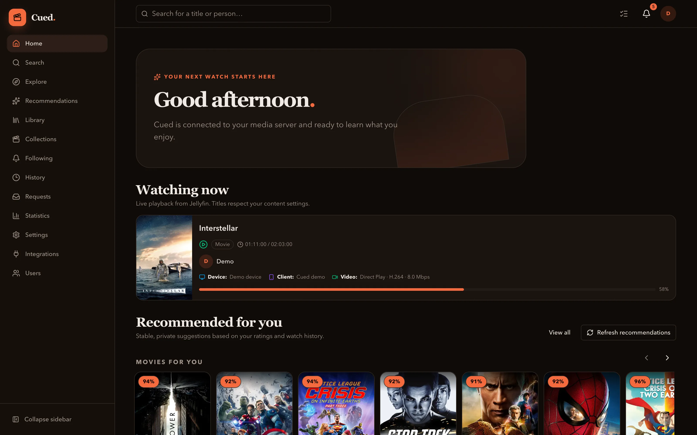
  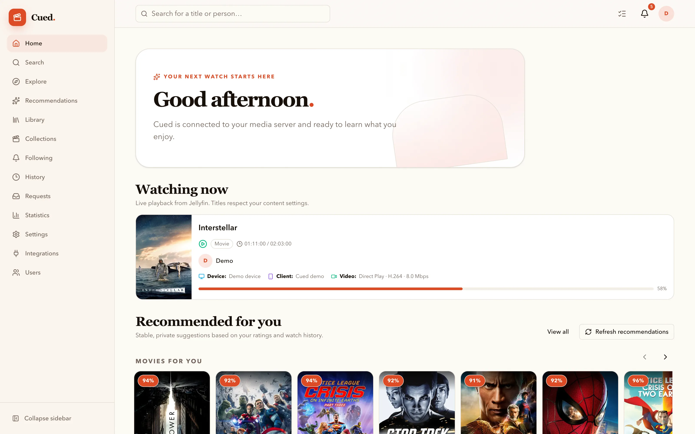
</p>
<p align="center">
  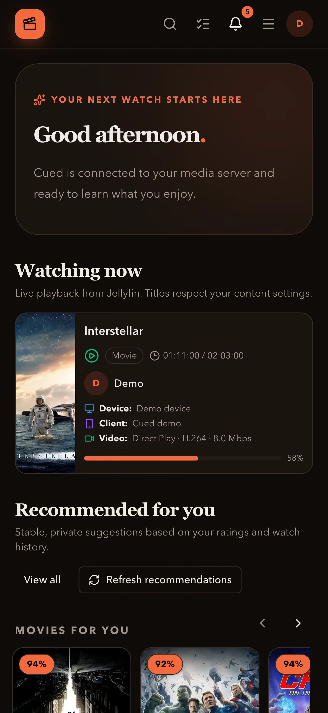
  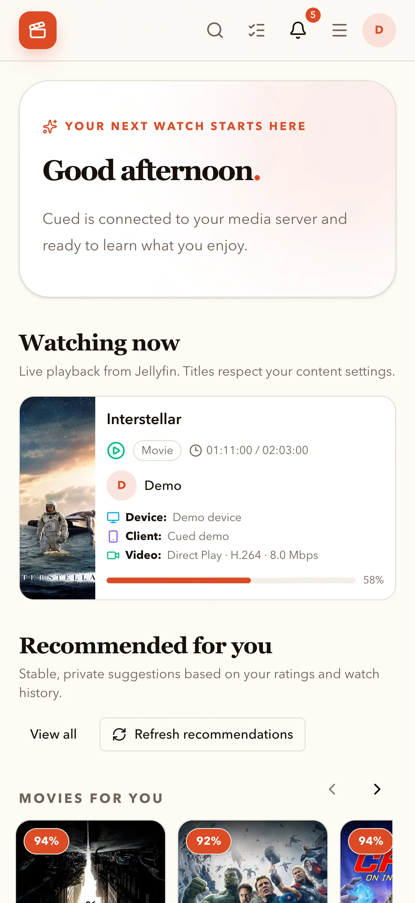
</p>

### Library

<p align="center">
  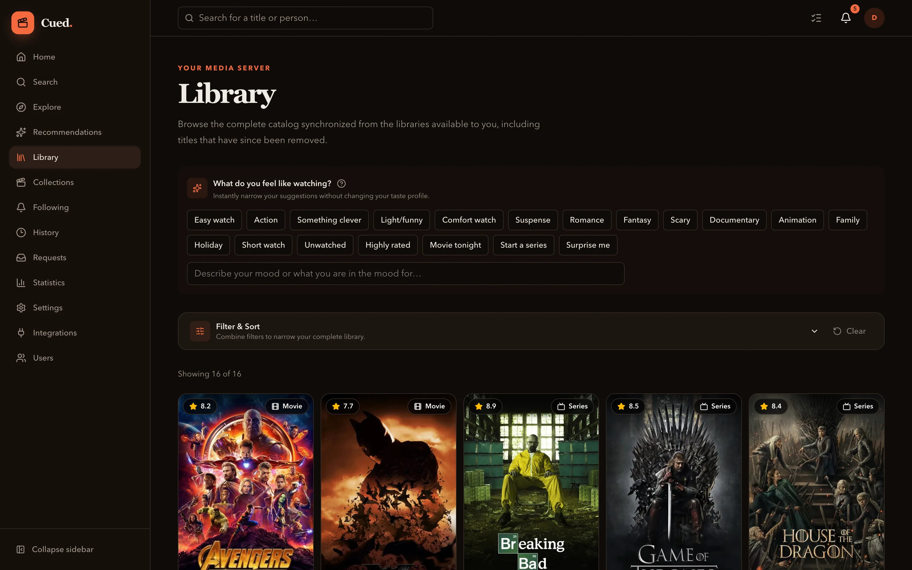
  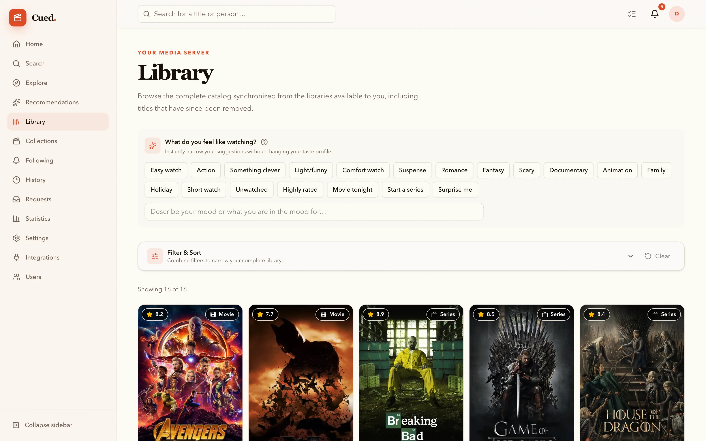
</p>
<p align="center">
  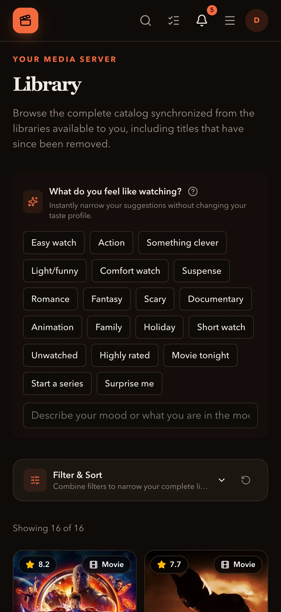
  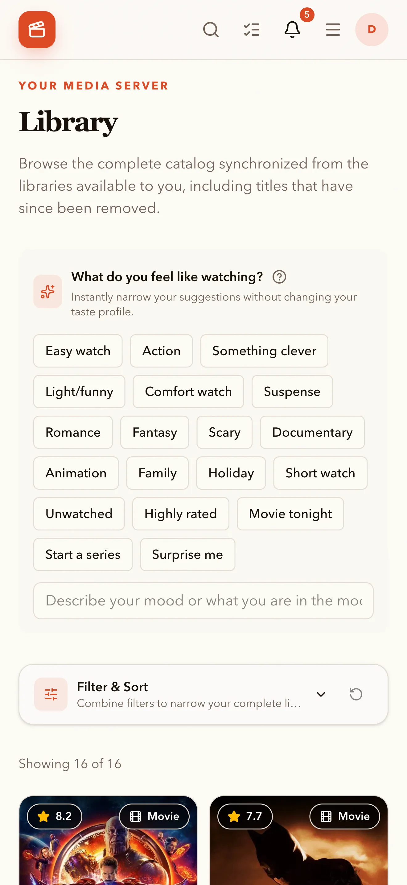
</p>

### Recommendations

<p align="center">
  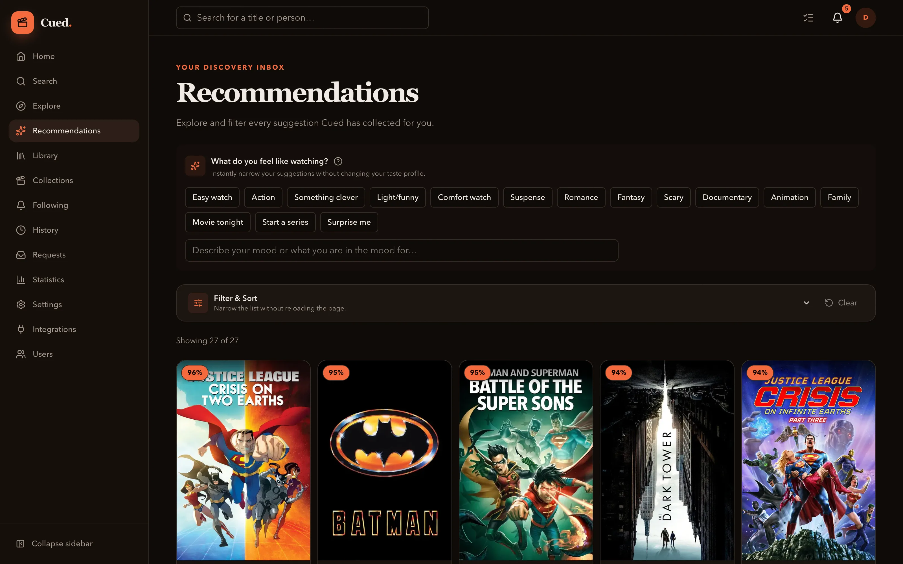
  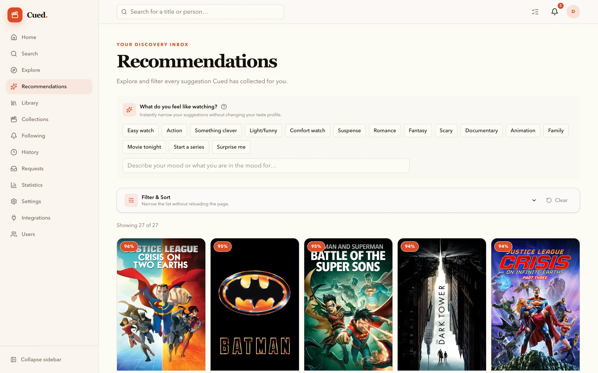
</p>
<p align="center">
  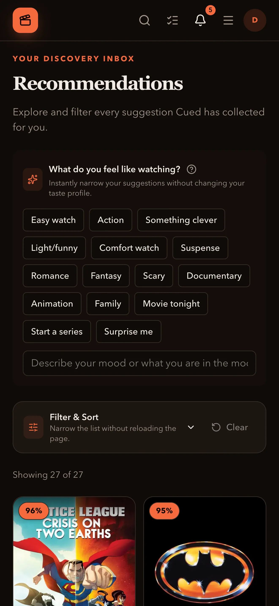
  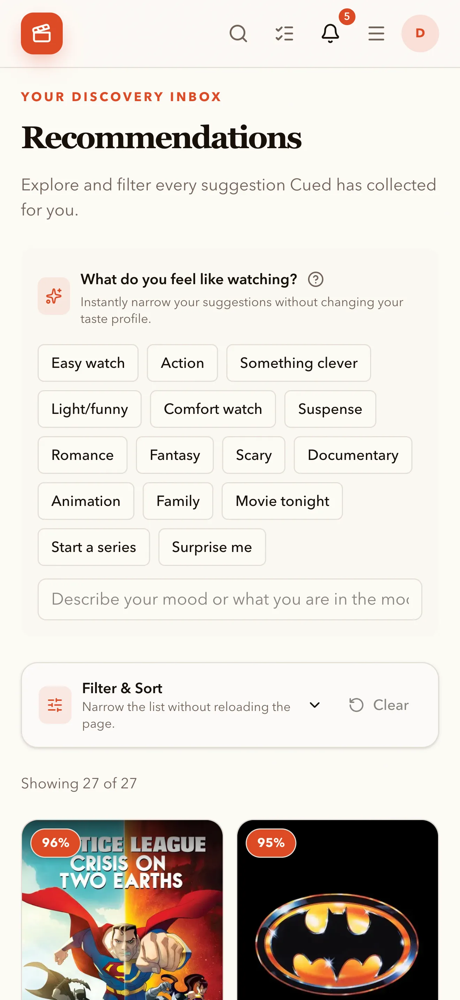
</p>

### Title details

<p align="center">
  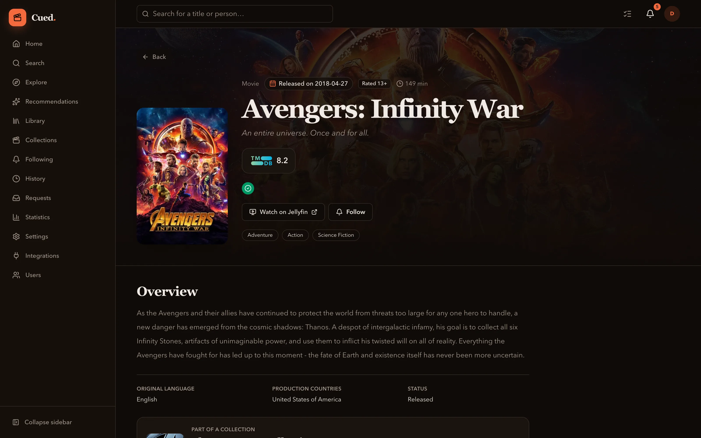
  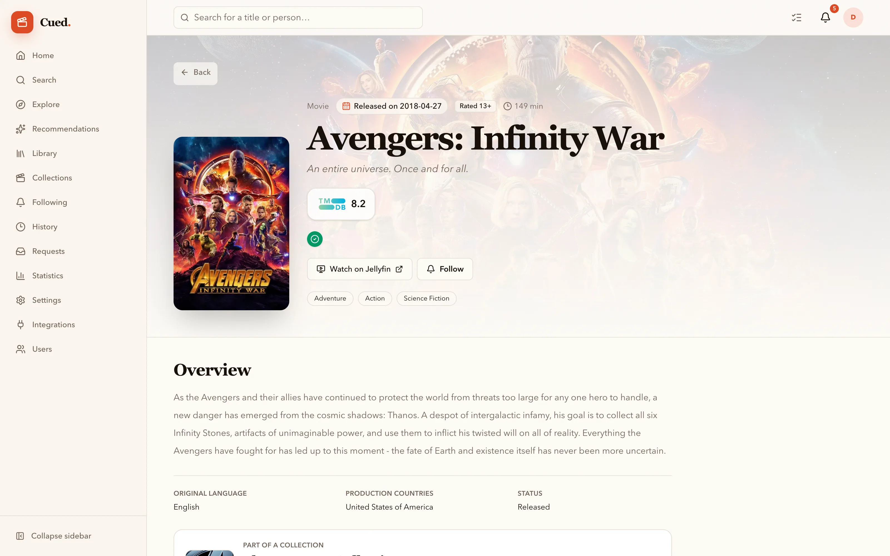
</p>
<p align="center">
  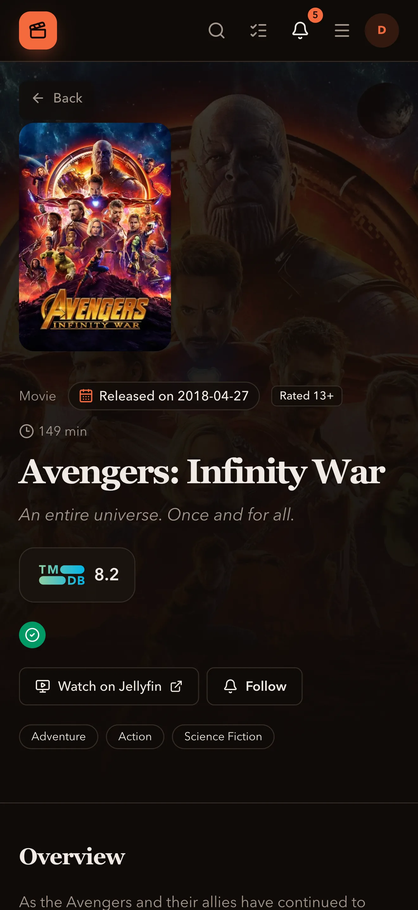
  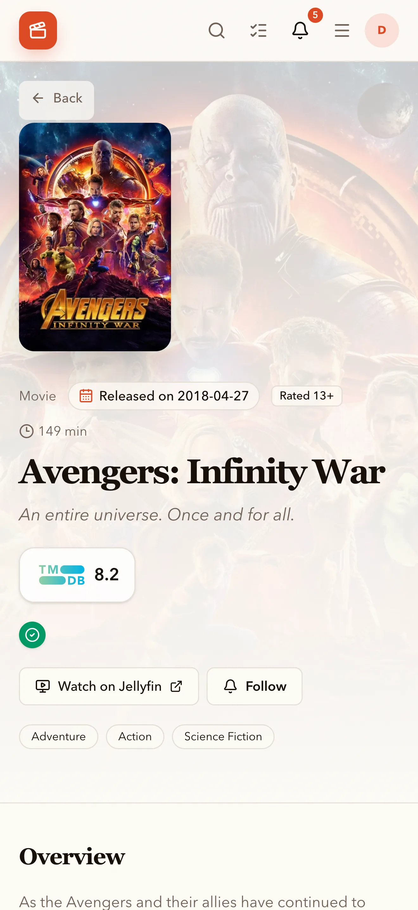
</p>

## Features at a glance

| Area            | What Cued provides                                                                                       |
| --------------- | -------------------------------------------------------------------------------------------------------- |
| Discovery       | TMDB search, Explore for trending and upcoming titles, filters, people, and collections                  |
| Recommendations | Persistent, personalized picks plus optional conversational discovery                                    |
| Jellyfin        | Sign-in, library import, watched state, availability, live sessions, and user permissions                |
| Requests        | Radarr/Sonarr requests and M3U Editor-backed STRM acquisition with approvals                             |
| Collections     | Imported Jellyfin collections, TMDB discovery, availability summaries, and whole-collection requests     |
| Privacy         | Per-user content guidance, visibility controls, localized preferences, and encrypted integration secrets |
| Operations      | Docker Compose deployment, PostgreSQL, backups, health checks, migrations, and release images            |

## Supported integrations

| Integration                                                                             | Purpose                                                                   |
| --------------------------------------------------------------------------------------- | ------------------------------------------------------------------------- |
| [Jellyfin](https://jellyfin.org)                                                        | Authentication, libraries, watch history, availability, and live sessions |
| [TMDB](https://www.themoviedb.org)                                                      | Metadata, discovery, people, ratings, and collections                     |
| [Radarr](https://github.com/Radarr/Radarr) / [Sonarr](https://github.com/Sonarr/Sonarr) | Movie and series requests                                                 |
| [M3U Editor](https://github.com/m3ue/m3u-editor)                                        | Optional STRM acquisition                                                 |
| OpenAI-compatible providers                                                             | Optional recommendation conversations, including OpenRouter               |
| [ntfy](https://ntfy.sh)                                                                 | Optional notifications                                                    |

## Quick start

The supported deployment is Docker Compose with PostgreSQL. Copy a Compose
example into an empty directory, set an encryption key and database password,
then start Cued:

```bash
docker compose pull
docker compose up -d --wait
```

Open `http://localhost:3000`, connect Jellyfin, and complete the guided setup.
For a production-safe walkthrough, backups, STRM mounts, upgrades, and rollback,
continue with [Install with Docker Compose](#install-with-docker-compose).

## Documentation and community

- [Product vision](docs/PRODUCT.md)
- [Architecture](docs/ARCHITECTURE.md)
- [Roadmap](docs/ROADMAP.md)
- [Release notes](CHANGELOG.md)
- [Local development](docs/DEVELOPMENT.md)
- [Contributing](CONTRIBUTING.md)
- [Security policy](SECURITY.md)
- [Report a bug](https://github.com/cuedapp/cued/issues/new?template=bug_report.yml)
- [Request a feature](https://github.com/cuedapp/cued/issues/new?template=feature_request.yml)

## License

Cued is free and open-source software licensed under the [GNU Affero General Public License v3.0 or later](LICENSE.md). If you run a modified version for users over a network, the AGPL requires you to offer those users the corresponding source code.

## Responsible use

Cued is self-hosted software. It does not operate a central hosting, streaming, or content-distribution service, and it does not provide media content.

Operators choose and configure their own integrations and media sources. They are responsible for ensuring that their use of Cued, connected services, and any content accessed through them complies with applicable law and the terms of those services.

Cued may store local metadata and create local STRM pointer files at the operator’s direction; it does not supply the underlying media. Cued is not affiliated with or endorsed by Jellyfin, TMDB, Radarr, Sonarr, M3U Editor, or any media provider.

The current implementation combines:

- [Jellyfin](https://github.com/jellyfin/jellyfin) watch history
- Localized [TMDB](https://www.themoviedb.org/) discovery
- Ratings
- Persistent personalized recommendations
- Optional [OpenAI](https://openai.com) or OpenRouter AI enhancement
- Managed [Radarr](https://github.com/Radarr/Radarr)/[Sonarr](https://github.com/Sonarr/Sonarr) requests
- Proactive following
- Notifications
- [M3U Editor](https://github.com/m3ue/m3u-editor)-backed STRM acquisition
- Viewing-intent recommendation contexts
- Server activity and recap statistics
- Portable user exports and full installation backups.
- Zero-data-retention routing for OpenRouter AI enhancement.
- User profiles and a paginated, historical media-library catalog.

See [the product specification](docs/PRODUCT.md), [roadmap](docs/ROADMAP.md), and [implemented architecture](docs/ARCHITECTURE.md).

Release notes are maintained in [CHANGELOG.md](CHANGELOG.md). Every published GitHub Release includes the corresponding changelog section; the release workflow rejects an empty description before publishing a container image.

## Local development

For developing Cued from source, see the dedicated [local development guide](docs/DEVELOPMENT.md). It covers the host-run Next.js workflow, the Docker PostgreSQL service, the `.env.example` template, database migrations, and verification commands.

## Requirements

- Docker Engine with Docker Compose v2

## Install with Docker Compose

### 1. Choose a Compose example

Install Docker Engine with Docker Compose v2. You do not need Node.js, pnpm, Git or a Cued checkout. Copy one of these files into an empty directory as `compose.yaml`:

- [Minimal installation](examples/docker-compose.yml) — Cued and PostgreSQL, without STRM output.
- [STRM installation](examples/docker-compose.strm.yml) — also mounts a host directory for M3U Editor `.strm` files.

PostgreSQL runs on an internal Docker network and is not published to the host.

### 2. Configure Cued

Create a `.env` file beside `compose.yaml` and generate the two required secrets:

```bash
touch .env
openssl rand -base64 32
openssl rand -hex 32
```

Add the generated values and any optional settings directly to your `.env` file.

Paste the first output as the encryption key and the second as the database password:

```dotenv
CUED_ENCRYPTION_KEY=PASTE_THE_BASE64_KEY_HERE
POSTGRES_PASSWORD=PASTE_THE_DATABASE_PASSWORD_HERE
```

Keep `CUED_ENCRYPTION_KEY` backed up. Cued uses it to encrypt Jellyfin sessions and integration credentials; losing or changing it makes stored secrets unreadable. Do not commit `.env`.

Create the STRM output directory (only if the app is used with m3u editor):

```bash
mkdir -p data/strm
```

To use an existing directory instead, change the host-side path in the STRM Compose example:

```yaml
volumes:
  - /path/to/existing/strm:/strm
```

On Linux, `CUED_UID` and `CUED_GID` must match the owner of that directory. Most installations use `1000:1000`; check yours with:

```bash
id -u
id -g
```

If either value differs from `1000`, put both in `.env`:

```dotenv
CUED_UID=YOUR_NUMERIC_UID
CUED_GID=YOUR_NUMERIC_GID
```

Cued then writes STRM files as the existing directory owner, so no ownership change is normally needed. Docker Desktop on macOS and Windows generally handles bind-mount permissions automatically.

### 3. Start Cued

With `compose.yaml` and `.env` in place, missing encryption keys or database passwords are rejected before startup.

```bash
docker compose pull
docker compose up -d --wait
docker compose logs -f cued
```

The Cued container waits for PostgreSQL, applies database migrations, and then starts the web server. A migration failure stops the container rather than running against an unknown schema. Once the health check passes, open `http://localhost:3000` or replace `localhost` with the Docker host’s address.

Complete the initial setup with the Jellyfin URL that is reachable **from the Cued container**. If Jellyfin is on the same Compose network, use its service name, for example `http://jellyfin:8096`. If it runs elsewhere, use the server’s LAN address; `localhost` inside the Cued container refers to Cued itself.

The Compose file pulls `ghcr.io/cuedapp/cued:latest`, the stable tag updated by each non-prerelease GitHub Release. Set `CUED_IMAGE=ghcr.io/cuedapp/cued:0.7.1` in `.env` to pin an exact release. Public GHCR packages require no registry login.

### 4. Share STRM files with Jellyfin

M3U Editor support is optional. When enabled, Cued writes `.strm` files below `/strm`. Jellyfin must see the same host directory. For a Jellyfin service in the same Compose project, add a read-only mount such as:

```yaml
services:
  jellyfin:
    # Keep the rest of your existing Jellyfin configuration.
    volumes:
      - ./data/strm:/media/cued-strm:ro
```

Then create Jellyfin movie and series libraries pointing to `/media/cued-strm/movies` and `/media/cued-strm/series`. Their names are unrestricted. In Cued, select those exact libraries under **Settings → Integrations → M3U Editor**; the mappings control both user access and which Jellyfin items Cued identifies as STRM media. M3U Editor requires the exported Xtream credentials, an API token, and the M3U Editor playback username (often `admin`): Cued uses the token to load and select a playlist, then writes password-free playback URLs containing that username and playlist UUID. Treat the UUID and generated STRM files as secrets.

### Updating, rollback and operating

Before every upgrade, create a full backup from **Settings → Backup and portability**, preserve `.env` (especially `CUED_ENCRYPTION_KEY`), and make a PostgreSQL dump:

```bash
docker compose exec -T postgres pg_dump -U cued cued > cued-before-upgrade.sql
```

Choose either a stable release, an exact immutable version, or an immutable digest in `.env`:

```dotenv
# Stable non-prerelease release
CUED_IMAGE=ghcr.io/cuedapp/cued:latest
# Exact release
# CUED_IMAGE=ghcr.io/cuedapp/cued:0.7.1
# Latest integration build; for testing only, never use this tag for a production deployment
# CUED_IMAGE=ghcr.io/cuedapp/cued:experimental
# Immutable image digest from GHCR
# CUED_IMAGE=ghcr.io/cuedapp/cued@sha256:REPLACE_WITH_DIGEST
```

Pull and start the selected image:

```bash
docker compose pull cued
docker compose up -d --wait
```

To roll back an application image, set `CUED_IMAGE` to the earlier version tag or digest and run the same commands. Cued migrations are forward-only: if the earlier image cannot operate against the migrated database, restore the matching PostgreSQL dump and full Cued backup rather than downgrading the schema in place.

To build the current checkout locally instead of pulling GHCR, use the development override:

```bash
docker compose -f compose.yaml -f compose.local.yaml up -d --build --wait
```

Useful commands:

```bash
docker compose ps
docker compose logs -f cued
docker compose restart cued
docker compose down
```

`docker compose down` preserves the named PostgreSQL volume. Do not add `--volumes` unless you intentionally want to delete the database. Back up both the `cued-postgres` volume and your stable `.env` encryption key. The production container does not watch source files; rebuilding is required after source changes.

## Configuration

### Docker Compose settings

The values below are Compose interpolation variables. Put them in the `.env` file beside `compose.yaml`; they are used when Compose expands the file before starting the services. They are not application settings that need to be added under a service's `environment:` block. The released Compose examples already wire the required values into the containers.

| Variable              | Must set in `.env` | Default                       | Purpose                                                                              |
| --------------------- | ------------------ | ----------------------------- | ------------------------------------------------------------------------------------ |
| `POSTGRES_PASSWORD`   | Yes                | —                             | PostgreSQL password; generate a strong value before startup                          |
| `CUED_ENCRYPTION_KEY` | Yes                | —                             | Encryption key passed to Cued for provider tokens and API keys                       |
| `LOG_LEVEL`           | No                 | `info`                        | Log level passed to Cued: `debug`, `info`, `warn`, or `error`                        |
| `CUED_UID`            | No                 | `1000`                        | User ID used to run Cued; set it to the owner of the STRM host directory             |
| `CUED_GID`            | No                 | `1000`                        | Group ID used to run Cued; set it to the group owning the STRM host directory        |
| `CUED_IMAGE`          | No                 | `ghcr.io/cuedapp/cued:latest` | Image tag or digest selected by Compose; use `compose.local.yaml` for a source build |
| `CUED_PORT`           | No                 | `3000`                        | Host port published by Compose                                                       |

Compose constructs the internal `DATABASE_URL` from `POSTGRES_PASSWORD`; do not add a host-based `DATABASE_URL` to the Compose template.

### Cued container environment

The Compose files pass these application variables into `services.cued.environment` automatically. Users normally do not need to edit this block; set the corresponding Compose variables in `.env` instead.

| Container variable    | Source in `.env`                     | Purpose                                                |
| --------------------- | ------------------------------------ | ------------------------------------------------------ |
| `DATABASE_URL`        | Constructed from `POSTGRES_PASSWORD` | Connection from Cued to the Compose PostgreSQL service |
| `CUED_ENCRYPTION_KEY` | `CUED_ENCRYPTION_KEY`                | Encrypts provider tokens and other stored secrets      |
| `LOG_LEVEL`           | `LOG_LEVEL`                          | Application logging level                              |

Jellyfin, TMDB, AI-provider, Radarr, Sonarr and M3U Editor credentials and configuration are stored through Cued, not added to the environment. Never commit `.env` files or credentials. Keep `CUED_ENCRYPTION_KEY` stable and backed up: changing or losing it makes stored provider and user tokens unreadable.

## Health

Health is exposed at `GET /api/health`. It returns HTTP 200 only when both the application and database are healthy.

## Jellyfin setup

On first launch, Cued asks for the Jellyfin URL reachable from the Cued process. The API key is optional during this step, so an administrator can add it later under **Settings → Integrations**. Users sign in with their Jellyfin username and password; Cued sends the password directly to Jellyfin and never stores it. Jellyfin administrators are initially mapped to the Cued administrator role.

An administrator can select the libraries imported server-wide and start either an update sync or a full resync. Update syncs enumerate the media index but batch-write only changed payloads, and use Jellyfin's per-user change cursor for watch history. Full resyncs scan all media and watch state and reconcile deletions. Cued applies each Jellyfin user's library permissions separately when importing watch state. Synchronization progress survives page reloads and reports the active library or user, completed totals and remaining work.

**Settings → Users** lists synchronized Jellyfin users, roles, avatars and library permissions. Jellyfin remains authoritative: later synchronizations update existing records and remove local users, libraries, media and inaccessible watch state that no longer exist in the configured Jellyfin scope.

## TMDB setup and discovery

Create a TMDB API Read Access Token in your TMDB account, then save it under **Settings → Integrations**. The token is encrypted and sent to TMDB only as a bearer authorization header. It is never included in a request URL or displayed again.

Authenticated users can search movies, series and people through **Search**. Results and details use the active Cued language (English, Swedish or Dutch), and include posters, backdrops, cast, selected crew and YouTube trailers where TMDB provides them. Movie and series results are marked as available only when the signed-in user can access the matching Jellyfin library. Search responses are cached for 15 minutes and title/person details for 24 hours to avoid unnecessary TMDB requests.

Jellyfin synchronization retains TMDB provider IDs for movies and series. Run one **Full resync** after upgrading from Milestone 2 to populate identifiers for the complete existing library.

## Radarr and Sonarr requests

Administrators can configure Radarr and Sonarr independently under **Settings → Integrations**. Cued tests each connection and discovers root folders, quality profiles and tags before saving defaults. Movies and series can then be requested from search results, recommendation cards or title pages. Administrators and users allowed to submit directly can choose a root folder and quality profile for each request, with the configured values selected by default. Existing Arr titles are recognized by TMDB ID and are not added twice.

Administrators submit requests directly. Requests from regular users require approval by default and appear in the administrator **Requests** queue. Approval-required users cannot choose provider settings; the administrator selects or changes the root folder and quality profile while reviewing the request. The same page includes a filterable history of approved, rejected and failed requests. Under **Settings → Users**, an administrator can allow an individual user to submit directly instead. Pending and reviewed requests are stored in Cued so approval state survives page reloads.

## Current scope

Milestones 1–19 cover the application foundation, Jellyfin synchronization, TMDB discovery, ratings and taste capture, personalized recommendations, optional AI conversations, Radarr/Sonarr and STRM acquisition, following, notifications, live sessions, activity and statistics, content guidance, collection discovery, backup/portability, and release automation with upgrade guidance.
