# Cued screenshot gallery

All screenshots use synthetic or fully redacted data. The root
[README](../../README.md) contains a short selection; this page includes every
desktop, light, and mobile capture.

## Dashboard

  
  

  
  

## Explore

  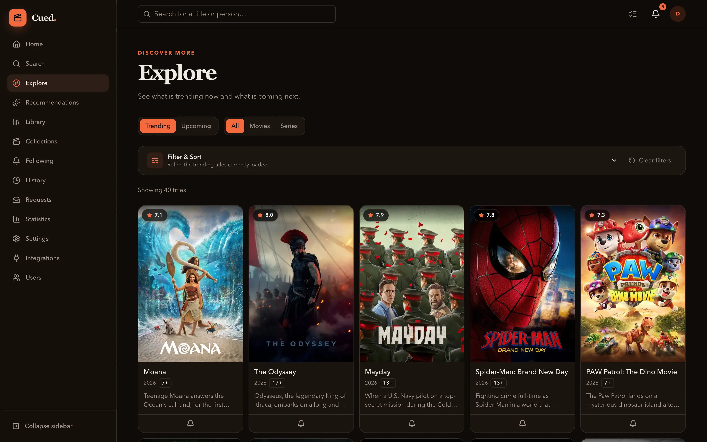
  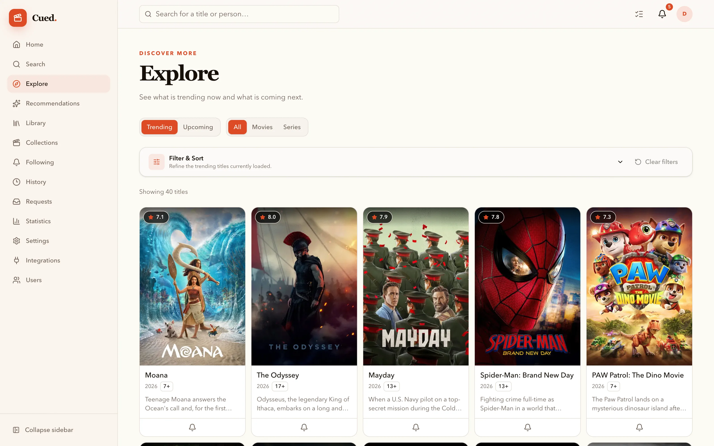

  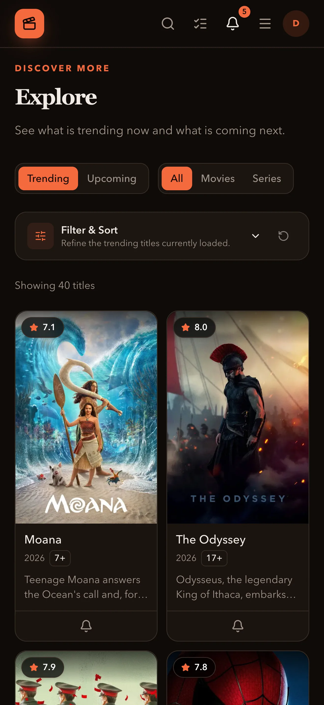
  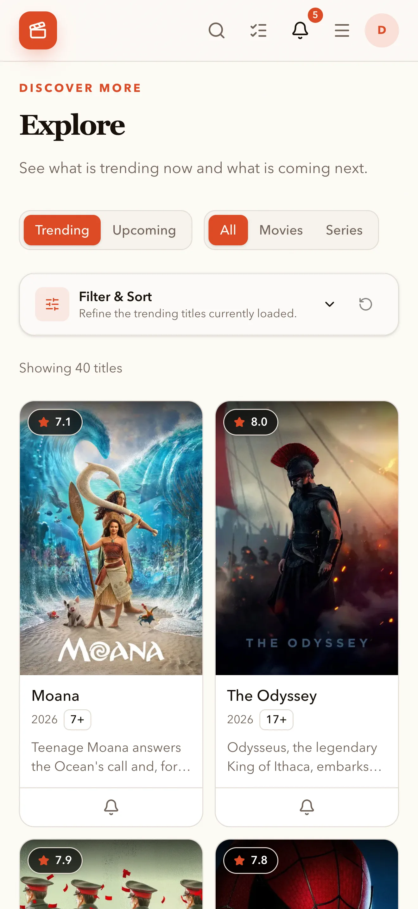

## Library

  
  

  
  

## Collections

  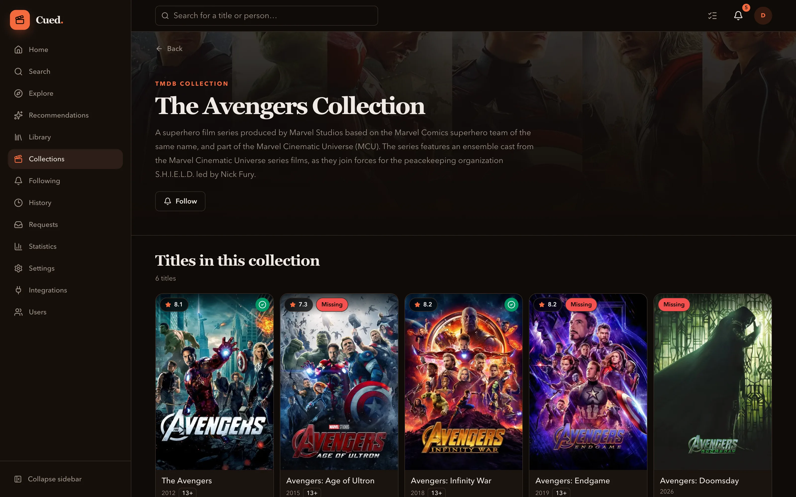
  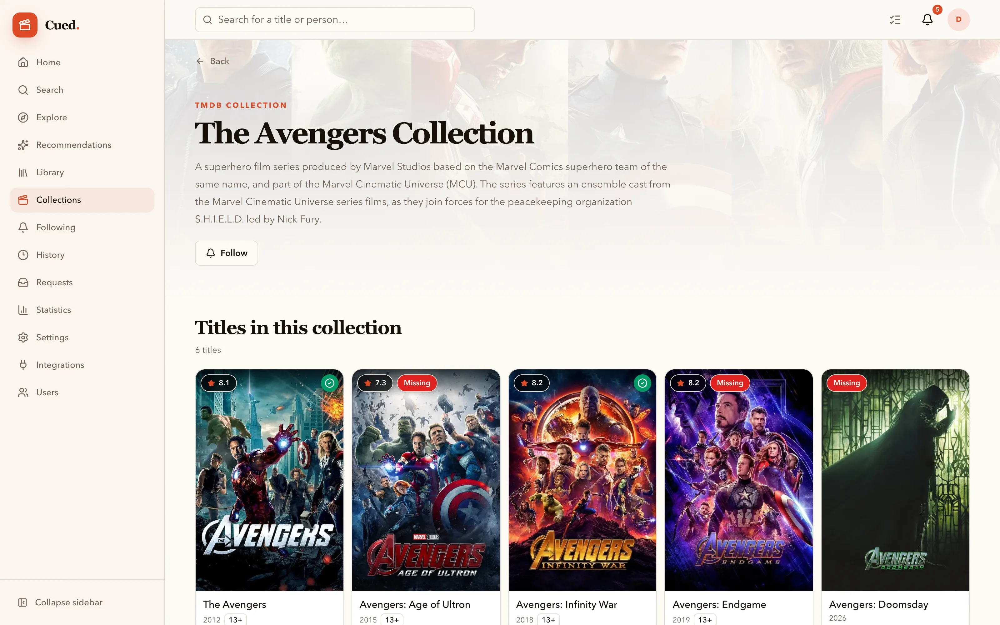

  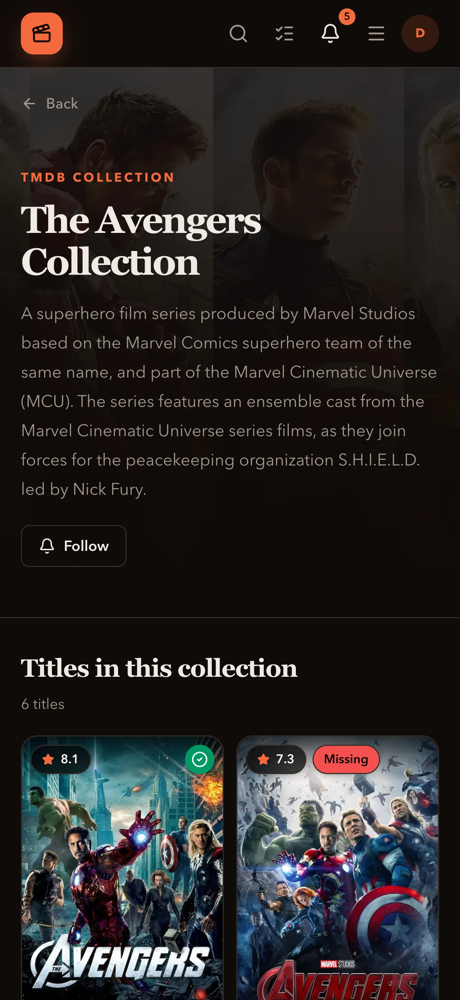
  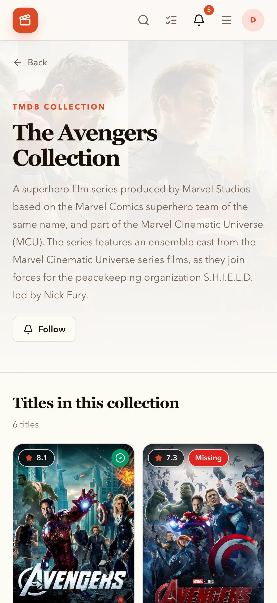

## Recommendations

  
  

  
  

## Search

  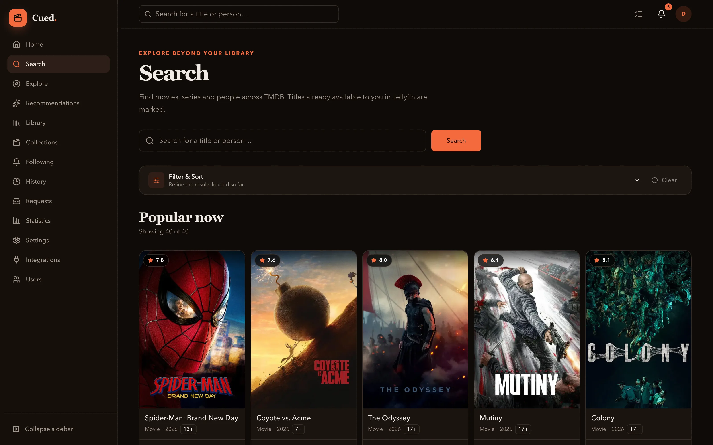
  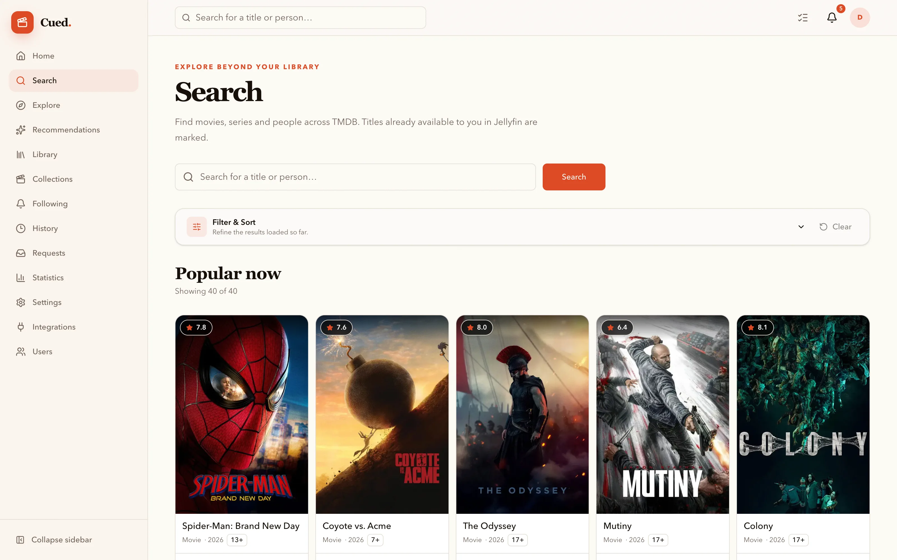

  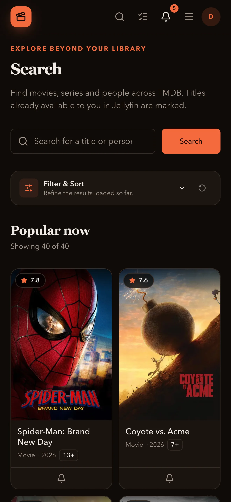
  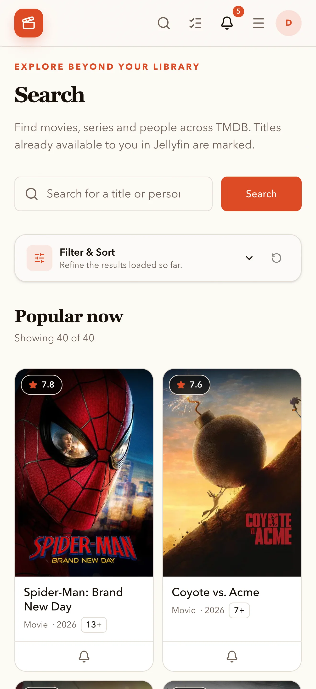

## Title details

  
  

  
  

